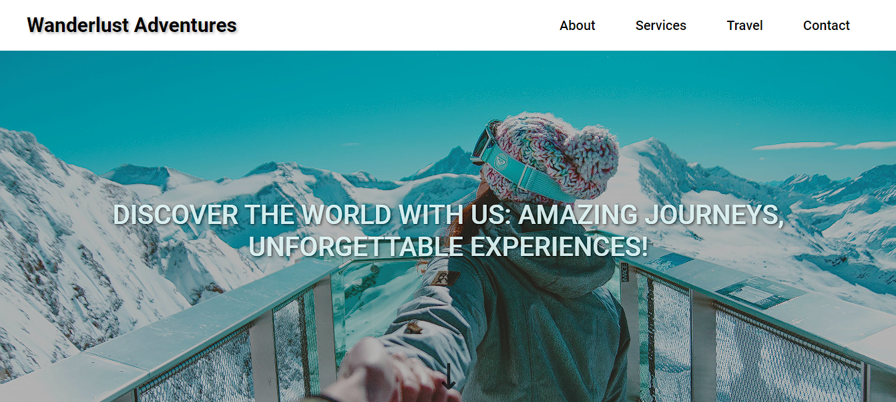

# Wanderlust Adventures - Landing Page ✈️🌍

Este é um projeto de uma landing page para a agência de viagens fictícia Wanderlust Adventures. O objetivo deste projeto é praticar e aprimorar habilidades em desenvolvimento web utilizando HTML, CSS com display Grid e display Flex.

## Tecnologias Utilizadas
-> HTML5
-> CSS3
 > Display Grid |
 > Display Flex

## Funcionalidades
- Layout responsivo para diferentes dispositivos e tamanhos de tela.
- Utilização de CSS Grid e Flexbox para organizar e estilizar os elementos da página.
- Design moderno e atraente para destacar os serviços oferecidos pela agência Wanderlust Adventures.

## Contribuição
Este é um projeto pessoal para prática e aprimoramento de habilidades. Caso tenha sugestões de melhorias ou correções, sinta-se à vontade para abrir uma issue ou enviar um pull request. 🚀
